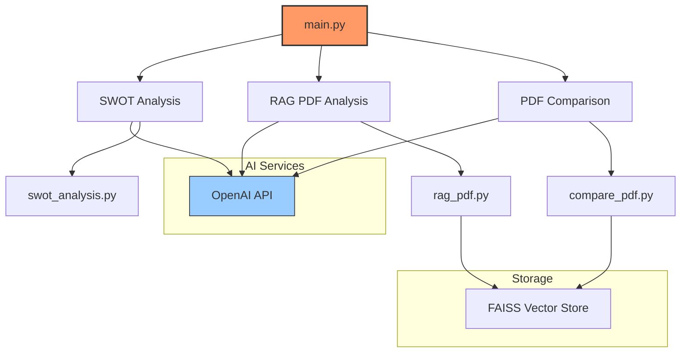

# FinBot: Your Financial Analyst 📄

An AI-powered financial document analysis tool built with **Streamlit** and **LangChain**.

---

## 🚀 Features

### **Core Functionalities**
1. **SWOT Analysis**  
   - Provides strengths, weaknesses, opportunities, and threats analysis for financial documents.
   - Powered by **OpenAI GPT-4o** for contextual insights.
   
2. **RAG PDF Analysis**  
   - Interactive question-and-answer functionality for uploaded documents.
   - Employs vector-based retrieval for precise answers.

3. **PDF Comparison**  
   - Compares multiple documents.
   - Extracts cross-document insights for informed decision-making.

---

## 🏗️ System Architecture



---

## 📦 Installation

1. Clone the repository:
   ```bash
   git clone
   cd finbot
   ```
2. Set up a virtual environment:
   ```bash
   python -m venv venv
   venv\Scripts\activate  # On Windows
   source venv/bin/activate  # On macOS/Linux
   ```
3. Install dependencies:
   ```bash
   pip install -r requirements.txt
   ```
4. Run the application:
   ```bash
   streamlit run main.py
   ```

---

## 🔧 Requirements

Ensure you have the following installed:

```text
langchain
python-dotenv
streamlit
unstructured
tiktoken
faiss-cpu
libmagic
OpenAI
pymupdf
langchain-community
langchain_openai 
```

---

## 🛠️ Tech Stack

- **Framework**: Streamlit
- **AI Model**: OpenAI GPT-4o
- **Vector Store**: FAISS
- **Document Processing**: PyPDF2
---

## 🌟 How It Works

1. **Upload Documents**: Drag and drop financial reports or other documents (PDFs up to 200 MB).
2. **Choose a Feature**: Select from SWOT Analysis, RAG PDF Q&A, or Document Comparison.
3. **AI Insights**: Receive AI-generated insights and analyses in real time.

---

## 📊 Survey Analysis

The project includes a comprehensive survey analysis conducted as part of a master thesis research:

- `survey_evaluation.ipynb`: Jupyter notebook containing analysis of the survey responses
- `responses.xlsx`: Raw survey response data
- Analysis can be run using Anaconda environment or Google Colab

---

Happy Analyzing! 🎉
